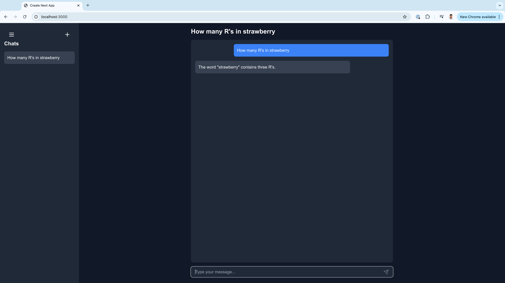

This is a [Next.js](https://nextjs.org) project bootstrapped with [`create-next-app`](https://nextjs.org/docs/app/api-reference/cli/create-next-app).

## Getting Started

Before running the development server, make sure to set up your environment variables:

1. Create a file named `.env.local` in the root directory of your project.
2. Add your OpenAI API key to the file:

   ```
   OPENAI_API_KEY=your_openai_api_key_here
   ```

   Replace `your_openai_api_key_here` with your actual OpenAI API key.

3. Make sure to add `.env.local` to your `.gitignore` file to keep your API key secret.

This step is crucial for the application to function correctly, as it uses the OpenAI API for generating responses.

## Development server:

```bash
npm run dev
# or
yarn dev
# or
pnpm dev
# or
bun dev
```

Open [http://localhost:3000](http://localhost:3000) with your browser to see the result.

You can start editing the page by modifying `app/page.tsx`. The page auto-updates as you edit the file.

This project uses [`next/font`](https://nextjs.org/docs/app/building-your-application/optimizing/fonts) to automatically optimize and load [Geist](https://vercel.com/font), a new font family for Vercel.

## Application Screenshot



This screenshot showcases the user interface of the application, featuring a dark-themed chat interface with a sidebar on the left and a main chat area on the right. The chat area displays a user's question "How many R's in strawberry" with a text input field below for entering messages.

## Learn More

To learn more about Next.js, take a look at the following resources:

- [Next.js Documentation](https://nextjs.org/docs) - learn about Next.js features and API.
- [Learn Next.js](https://nextjs.org/learn) - an interactive Next.js tutorial.

You can check out [the Next.js GitHub repository](https://github.com/vercel/next.js) - your feedback and contributions are welcome!

## Deploy on Vercel

The easiest way to deploy your Next.js app is to use the [Vercel Platform](https://vercel.com/new?utm_medium=default-template&filter=next.js&utm_source=create-next-app&utm_campaign=create-next-app-readme) from the creators of Next.js.

Check out our [Next.js deployment documentation](https://nextjs.org/docs/app/building-your-application/deploying) for more details.
